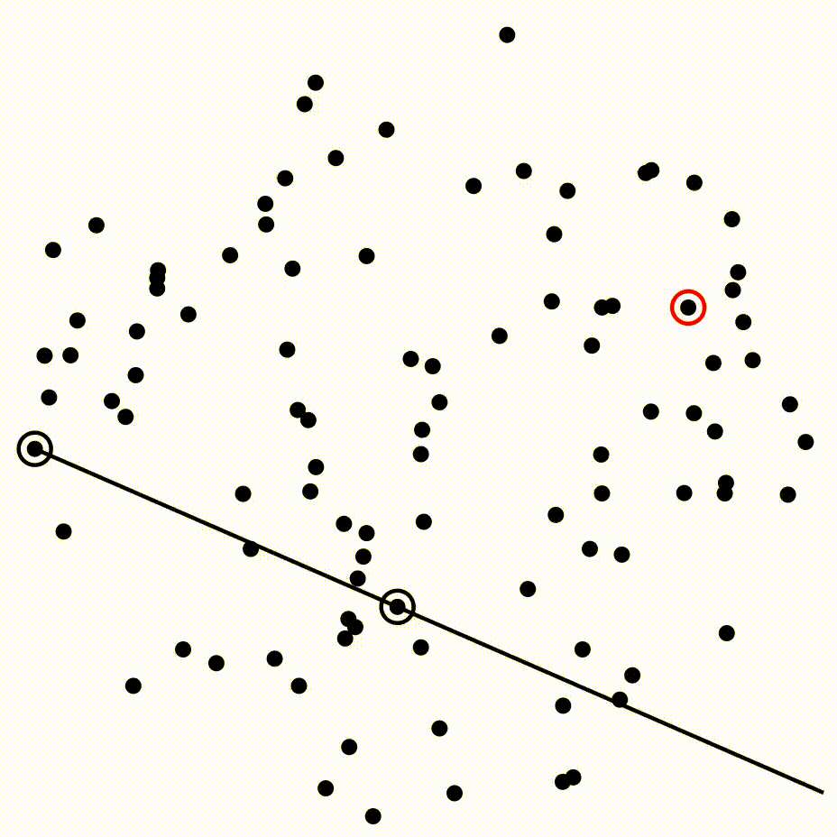
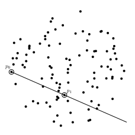
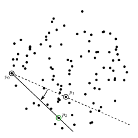
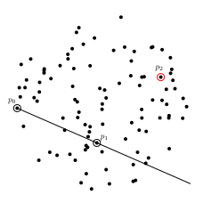
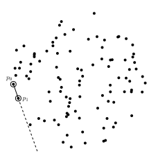
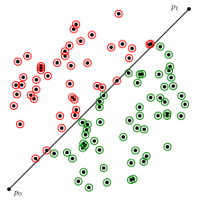
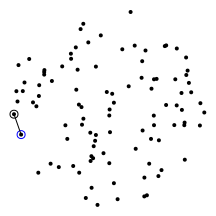
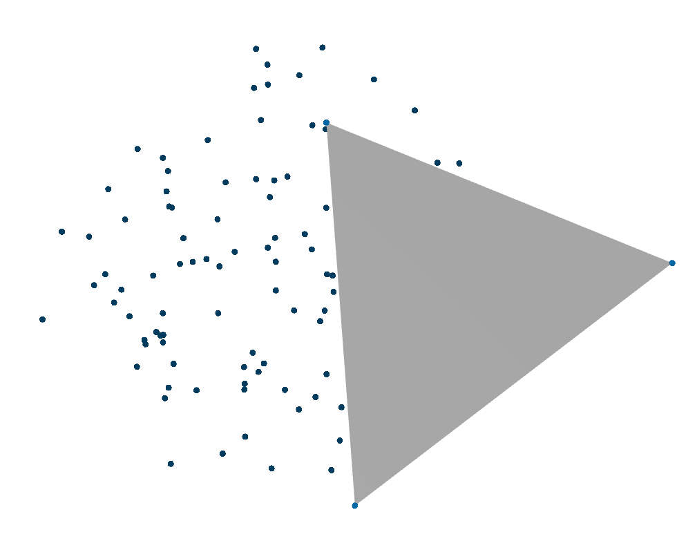
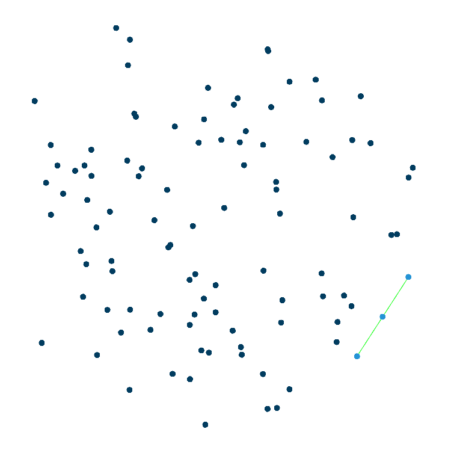
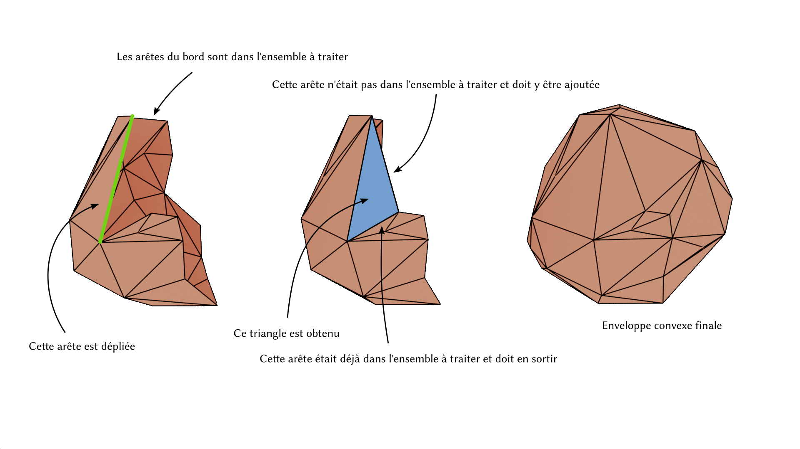

# Enveloppe convexe par marche de Jarvis

Implementation la marche de Jarvis pour calculer l'enveloppe
convexe d'un ensemble de points en 2D, puis si le temps le permet de généraliser
cette approche pour un ensemble de points en 3D. Notez cependant que la marche
de Jarvis n'est pas un algorithme optimal pour le calcul de l'enveloppe convexe
en terme de complexité.

## Code de base

Ce dépôt contient un code de base pour gérer quelques fonctionnalités de base :

* `algebra.[hc]pp` : vecteurs 2d et 3d, opérations usuelles, petits déterminants
* `sampling.[hc]pp` : génération aléatoire de points
* `svg.hpp` : génération d'images svg, [récupéré ici](https://github.com/vincentlaucsb/svg)
* `main.hpp` : squelette de code à compléter et tests

En particulier, le code de base fournit le prédicat `orient` sur lequel cet
algorithme est fondé, et qui permet (dans la version 2D) de déterminer si un
point est à gauche ou à droite du segment formé par deux points. Un premier test
dans la fonction `main` vous produit une image de test pour vous illustrer le
fonctionnement de ce prédicat dans le cas 2D.

Votre code pour ce TP peut être ajouté au fichier `main.cpp`, ce qui ne devrait
pas nécessiter de modifications au Makefile pour le compiler.

## Marche de Jarvis

La marche de Jarvis est un algorithme qui part d'un point de l'enveloppe
convexe, et qui trouve les autres un par un à partir de ce point, en
construisant une par une les arêtes de l'enveloppe convexe.

<center>
  
</center>

### Travail 1 : trouver un point de l'enveloppe convexe

Pour initialiser l'algorithme, il est nécessaire de trouver un premier point de
l'enveloppe convexe. Un tel point est par exemple le point ayant la coordonnée x
minimale.

Complétez la fonction `hull_point` dans `main.cpp` pour qu'elle retourne
l'indice du point ayant la plus faible coordonnée en x dans le tableau de points
fourni en entrée. Une fois fonctionnelle, vous pouvez activer le test
correspondant en décommentant la ligne `#define HULL_POINT_TEST` dans la
fonction `main`. Ce test devrait vous produire une image semblable à la
suivante dans le fichier `hull_point.svg`.

<center>
  
</center>

### Travail 2 : dépliement 2D

La marche de Jarvis découvre une par une les arêtes de l'enveloppe convexe via
une opération de *dépliement*. Cette opération nécessite un point `p0` sur
l'enveloppe convexe. Elle initialise ensuite l'arête en utilisant n'importe quel
point `p1` différent de `p0`. 

<center>
  
</center>

Pour chaque point `p2` de l'ensemble différent de `p0` et `p1`, si le point `p2`
est *à droite* du segment `[p0, p1]`, le point `p1` est remplacé par le point
`p2`. 

<center>
  
</center>

Lorsque le point `p2` est à gauche, rien ne se passe.

<center>
  
</center>

À l'issue de cette boucle, le segment `[p0, p1]` est une arête de l'enveloppe convexe.

<center>
  
</center>

Pour déterminer si un point `p2` est à droite ou à gauche d'un segment `[p0,
p1]`, vous utiliserez la fonction `orient` qui vous est fournie en haut de
`main.cpp`. Lorsque vous appellerez `orient(p0, p1, p2)`, le résultat vous
donnera -1 si `p2` est à droite, 1 s'il est à gauche, et 0 s'il est aligné.
Dans l'image si dessous, les points à gauche pour lesquels le prédicat est
positif sont en vert, et les points à droite pour lesquels le prédicat est
négatif sont en vert. Si vous êtes daltonien·ne les points verts sont en bas à
droite et les rouges en haut à gauche.

<center>
  
</center>

Pour cette partie, vous complèterez la fonction `wrap` proposée dans `main.cpp`.
Cette fonction prend en paramètres l'ensemble des points et le point `p0` autour
duquel le dépliement est réalisé. Elle renvoie l'indice dans le tableau de
points du point `p1` obtenu à l'issue de l'opération. Pour tester votre
fonction, vous décommenterez la ligne `#define WRAP_2D_TEST` dans la fonction
`main`. Le programme devrait alors vous générer l'image suivante dans le fichier
`wrap.svg`.

<center>
  
</center>

### Travail 3 : enveloppe convexe 2D

Munis de la fonction de dépliement il vous devient possible de réaliser la
marche de Jarvis. En partant du premier point de l'enveloppe convexe obtenu via
la fonction `hull_point`, une action de dépliement autour de ce point devrait
vous fournir une arête de l'enveloppe convexe, ainsi qu'un second point de
l'enveloppe convexe. Il est alors possible de relancer un dépliement depuis ce
second point pour en trouver un troisième, et ainsi de suite. Cet algorithme
s'arrête lorsque le point trouvé est le point initial qui avait été obtenu via
`hull_point`.

<center>
  
</center>

Pour ce travail, vous complèterez la fonction `jarvis2d` dans le fichier
`main.cpp`. Cette fonction prend en paramètre le tableau de points et une
référence sur un `vector` d'indices que vous remplirez avec les indices des
sommets de l'enveloppe convexe dans le tableau de points. Vous décommenterez
dans la fonction `main` la ligne `#define HULL_2D_TEST`. Le programme devrait alors
vous générer l'image suivante dans le fichier `hull_2d.svg`.

<center>
  
</center>

<!-- TODO détailler et illustrer ce qui suit, ajouter les tests dans le main -->

### Travail 4 : dépliement 3D

Le dépliement 3D fonctionne de la même façon que le dépliement 2D, mais il
nécessite un point supplémentaire. Le principe en 3D est de partir d'une arête
[p0, p1] de l'enveloppe convexe, et de chercher un point `p2` tel que le
triangle `[p0, p1, p2]` soit une face de l'enveloppe convexe. Le dépliement
initialise `p2` à n'importe quel point de l'ensemble différent de `p0` et `p1`.
En 3D, si les trois points ne sont pas alignés, il existe un unique plan passant
à la fois par `p0`, `p1` et `p2`. Vous trouverez en haut de `main.cpp` un
prédicat `orient` qui prend cette fois quatre points 3D `p0`, `p1`, `p2` et `p3`
et renvoie -1 si `p3` est *en dessous* du plan passant par `p0`, `p1` et `p2`,
et 1 s'il est *au dessus*.

Attention, en 3D, la notion de *dessus* ou *dessous* dépend de l'ordre dans
lequel les sommets sont fournis. Ici `p3` est considéré comme *au dessous* du
triangle `[p0, p1, p2]` si en se plaçant au niveau du point `p3` et en regardant
le triangle, les sommets `p0`, `p1` et `p2` dans cet ordre tournent dans le sens
des aiguilles d'une montre.

De même qu'en 2D, l'idée est d'itérer sur tous les points de l'ensemble, et
lorsqu'un point `p3` est trouvé au dessous du plan passant par `p0`, `p1` et
`p2`, c'est à dire que `orient(p0, p1, p2, p3)` vaut -1,  ce point est utilisé
pour remplacer `p2`. À l'issue de cette boucle, le triangle `[p0, p1, p2]` est
un triangle de l'enveloppe convexe.

Créez une surcharge de la fonction `wrap` prenant un ensemble de points 3D en
entrée (un `vector` de `vec3`), ainsi que les deux points `p0` et `p1`, et
renvoyant l'indice dans le tableau de points du point `p2` obtenu à l'issue de
la boucle. Une fois implémentée, vous pourrez décommenter la ligne `#define
WRAP_3D_TEST` dans la fonction `main`. Le programme produira alors un fichier
`wrap_3d.obj` que vous pourrez visualiser sur 
[MeshLabJs](https://meshlabjs.net) sans rien installer sur votre machine. Vous
devriez alors voir quelque chose ressemblant à 

<center>
  
</center>

Ce test réalise un dépliement entre les sommets `(-1,-1,0)` et `(-1,1,0)` qui
sont deux coins de la boîte englobante des points, et le dépliement devrait
fournir un sommet de l'enveloppe convexe tel que tous les points de l'ensemble
sont du même côté du triangle affiché.

### Travail 5 : une arête de l'enveloppe convexe

Pour initialiser la marche de Jarvis, il est cette fois nécessaire d'avoir à sa
disposition une *arête* de l'enveloppe convexe. Pour obtenir le point `p0` de
cette arête, nous pouvons continuer à utiliser le point ayant la coordonnée x
minimale. Pour le point `p1`, nous allons utiliser un dépliement 3D. Le principe
est d'introduire un faux point `q` supplémentaire ayant la même coordonnée x que
`p0`. Vu que `q` a la même coordonnée x que `p0`, nous avons la garantie que si
`q` avait réellement fait partie de l'ensemble de points, il serait sur
l'enveloppe convexe, et que l'arête `[p0, q]` serait une arête de l'enveloppe
convexe. En effectuant un dépliement 3D avec les points `p0` et `q`, le point
`p2` obtenu est un point de l'enveloppe convexe, et l'arête `[p0, p2]` est une
arête de l'enveloppe convexe.

Pour que cette partie fonctionne, il est nécessaire de pouvoir obtenir le point
`p0` via la fonction `hull_point`. Créez donc une surcharge de cette fonction 
pour faire en sorte qu'elle fonctionne avec des `vec3` également.
Décommentez ensuite la ligne `#define HULL_EDGE_TEST` pour faire en sorte que le
programme génère un fichier `init_edge.obj` qui devrait ressembler à

<center>
  
</center>

Dans cette image, le point du milieu de l'arête a été ajouté pour créer un
triangle artificiel dégénéré le long de l'arête entre `p0` et `p2`. Pour
afficher cette arête et les points, il faut penser à activer l'affichage des
sommets et des bords sur MeshlabJS

<center>
  
</center>

Pour ce test, le point `q` utilisé est calculé comme `p0 + (0,1,0)` ce qui nous
assure qu'il a la même coordonnée x que `p0`. Vous pouvez visualiser [un exemple
interactif en suivant ce
lien](https://liris.cnrs.fr/vincent.nivoliers/mif27/gift_wrapping/wrap3d.html).
Dans cet exemple, vous pouvez manipuler le plan pivoté en déplaçant le point sur
l'arc de cercle. Le point `p1` obtenu est indiqué en rouge. Tous les autres
points sont *au dessus* du triangle `[p0,q,p1]` car depuis tous les autres
points, en regardant le triangle, les sommets tournent dans le sens contraire
des aiguilles d'une montre.

Vous pourrez utiliser cette méthode dans la prochaine partie pour obtenir la
première arête de votre enveloppe convexe.

### Travail 6 : enveloppe convexe 3D

À partir d'une arête, il devient possible de déplier pour trouver un premier
triangle de l'enveloppe convexe. Ce premier triangle fournit de nouvelles arêtes
à partir desquelles déplier à nouveau, et en propageant ces dépliements, il est
alors possible de construire entièrement l'enveloppe convexe 3D des points.
Cette propagation est néanmoins plus compliquée que dans le cas 2D. En 2D chaque
dépliement apportait un nouveau point, jusqu'à ce que le nouveau point soit le
point initial. Il n'était donc pas compliqué de propager et de détecter la fin
de la propagation. En 3D par contre, chaque triangle déplié depuis une de ses
arêtes en fournit deux autres. Il devient alors nécessaire d'utiliser une
structure de donnée pour suivre les arêtes à déplier.

<center>
  
</center>

Pour gérer cette ensemble d'arêtes à traiter vous pouvez par exemple utiliser

```cpp
using edge = std::pair<std::size_t, std::size_t> ;
``` 

pour modéliser une arête et 

```cpp
using edgeset = std::set<edge> ;
``` 

pour gérer l'ensemble d'arêtes à traiter.

Cette question est volontairement peu détaillée, car si vous arrivez ici avec
encore du temps, vous aurez probablement envie de ne pas vous faire spoiler la
solution par des étapes trop détaillées.
